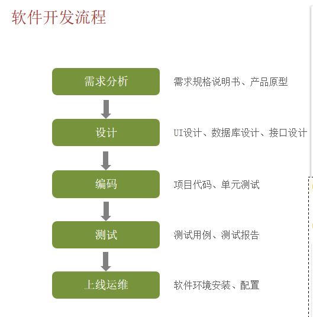
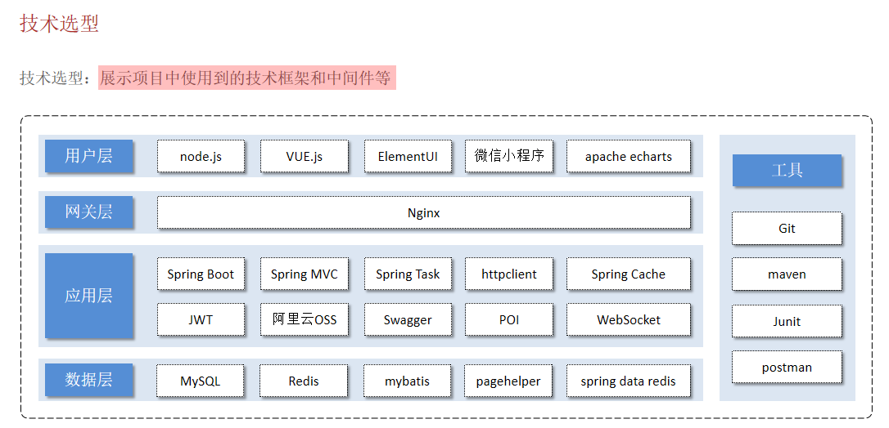
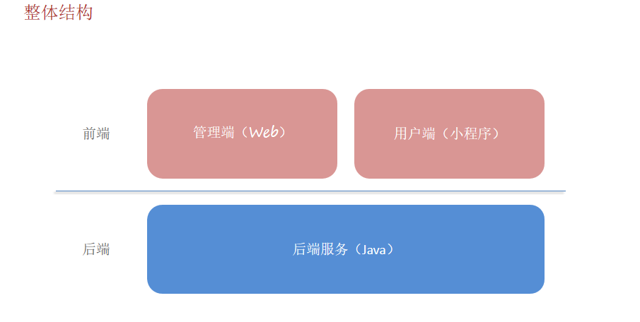

# Day01知识点总结

## 1.软件开发



软件开发经历的阶段：

- 需求分析：编写需求规格说明书，设计产品原型
- 设计：包括UI设计，数据库设计，接口设计，技术选型（选择什么技术栈）
- 编码：前端开发人员和后端开发人员共同合作编写代码，实现功能
- 测试：测试人员对各个功能，模块进行测试，确保满足用户需求。（测试和编码是同时进行的，并不是等整个项目的代码都写完再去测试的，没有这么多时间可以浪费，一边测试一边修改）
- 运维：运行维护，部署项目

## 2.软件环境

- 开发环境：开发人员在开发阶段使用的环境
- 测试环境：测试人员使用的环境，用于测试项目
- 生产环境：正式提供对外服务的环境

## 3.技术选型和整体结构





## 4.nginx反向代理

前端发送的请求地址和后端提供的接口地址不一致，是如何请求到后端服务的？

nginx反向代理：前端发送的请求通过 nginx 转发到后端服务器中，同样的，nginx 将后端服务器返回的数据转发给前端。

nginx反向代理的好处：

- 提高访问速度
- 进行负载均衡（将大量的请求分发给多个后端服务器，防止出现一台服务器繁忙其他服务器清闲的状况）
- 保证后端服务安全（用户发送的请求只能到达 nginx，再通过 nginx 转发，不会直接到达后端服务器，防止恶意攻击）

## 5.使用`DigestUtils`进行MD5加密

`DigestUtils.md5DigestAsHex()` 是 Apache Commons Codec 库提供的一个方法，用于将输入数据进行 MD5 加密并返回一个十六进制字符串形式的结果。

引入依赖：

```xml
<dependency>
    <groupId>commons-codec</groupId>
    <artifactId>commons-codec</artifactId>
    <version>1.15</version>  <!-- 使用合适的版本 -->
</dependency>
```

`DigestUtils.md5DigestAsHex()`的使用：

```java
import org.apache.commons.codec.digest.DigestUtils;

public class MD5Example {
    public static void main(String[] args) {
        String input = "Hello, world!";
        // 使用 md5DigestAsHex() 方法进行 MD5 加密
        // 该方法需要字节数组作为输入，将要加密的字符串的字节数组作为参数传入，返回加密后的字符串
        String md5Hex = DigestUtils.md5DigestAsHex(input.getBytes());
        System.out.println("MD5 加密结果: " + md5Hex);
    }
}
```

## 6.Swagger的使用

项目代码：

```java
    /**
     * 通过knife4j生成接口文档
     * @return
     */
    @Bean
    public Docket docket() {
        ApiInfo apiInfo = new ApiInfoBuilder()
                .title("苍穹外卖项目接口文档")
                .version("2.0")
                .description("苍穹外卖项目接口文档")
                .build();
        Docket docket = new Docket(DocumentationType.SWAGGER_2)
                .apiInfo(apiInfo)
                .select()
                .apis(RequestHandlerSelectors.basePackage("com.sky.controller"))
                .paths(PathSelectors.any())
                .build();
        return docket;
    }

    /**
     * 设置静态资源映射
     * @param registry
     */
    protected void addResourceHandlers(ResourceHandlerRegistry registry) {
        registry.addResourceHandler("/doc.html").addResourceLocations("classpath:/META-INF/resources/");
        registry.addResourceHandler("/webjars/**").addResourceLocations("classpath:/META-INF/resources/webjars/");
    }
```

要在 Spring Boot 项目中使用 Swagger（或者 Knife4j，这是 Swagger 的一个增强版），你需要进行一些配置。通过这些配置，Spring Boot 可以生成并展示 API 接口文档，便于前端和后端开发人员查看和测试 API。上述这段代码是实现这个功能的关键部分。

### (1)生成 API 接口文档

```java
@Bean
public Docket docket() {
    ApiInfo apiInfo = new ApiInfoBuilder()
            .title("苍穹外卖项目接口文档")
            .version("2.0")
            .description("苍穹外卖项目接口文档")
            .build();
    Docket docket = new Docket(DocumentationType.SWAGGER_2)
            .apiInfo(apiInfo)
            .select()
            .apis(RequestHandlerSelectors.basePackage("com.sky.controller"))
            .paths(PathSelectors.any())
            .build();
    return docket;
}
```

- @Bean：告诉 Spring 容器将该方法返回的 `Docket` 实例作为一个 Bean 注册到容器中，Spring Boot 启动时会自动创建并初始化它。
- apiInfo：用于定义 API 文档的元信息，例如标题、版本和描述。这样 Swagger 生成的文档上就会显示这些信息，帮助开发者快速理解文档的基本情况。
- Docket：Docket是 Swagger 配置的核心类，`Docket` 类用于定义接口文档的具体配置。
- DocumentationType.SWAGGER_2：指定你使用的是 Swagger 2 版本的文档。这个值是 Swagger 的一个标准，指明了文档生成的格式。
- RequestHandlerSelectors.basePackage("com.sky.controller")：限制 Swagger 扫描特定的包。在你的项目中，可能有很多包，但是你只希望 Swagger 扫描并生成 `com.sky.controller` 包下的接口文档，可以避免将不必要的类暴露在文档中。
- PathSelectors.any()：暴露所有的 API 路径。如果你想过滤掉某些路径，可以使用更具体的匹配规则。
- docket.build()：完成 Docket 配置，生成最终的文档配置。

### (2)访问 Swagger UI 页面

Swagger UI 页面通常依赖于静态的资源文件（如 HTML、JS、CSS 等），这些文件需要被正确映射到 Web 应用中。默认情况下，这些文件通常存放在 `META-INF/resources` 目录中。因此，需要配置资源映射，以确保浏览器能够正确加载这些静态资源。

```java
protected void addResourceHandlers(ResourceHandlerRegistry registry) {
    registry.addResourceHandler("/doc.html").addResourceLocations("classpath:/META-INF/resources/");  // 映射 doc.html 到 Swagger UI 页面
    registry.addResourceHandler("/webjars/**").addResourceLocations("classpath:/META-INF/resources/webjars/");  // 映射 webjars 目录中的资源
}
```

- **/doc.html**：这个路径通常是 Swagger UI 页面默认的访问路径，用户可以通过访问 `http://ip:port/doc.html` 来查看 API 文档页面。
- **/webjars/**：这个路径映射了 Swagger UI 所需要的 JavaScript、CSS 等资源，这些资源被存储在 `META-INF/resources/webjars/` 目录下。

## 7.Builder Pattern

Builder Pattern（建造者模式）是一种设计模式，常用于那些复杂对象的创建过程。它将对象的创建和使用分离，允许通过逐步构建对象的各个部分，最后通过 `build()` 方法完成对象的创建。

在上述代码中，`Docket` 类就使用了建造者模式来配置和生成 Swagger 文档。`Docket` 对象本身是一个复杂的配置对象，包含了多个可选的配置项，如 API 信息、接口扫描的包、路径选择等。通过链式调用的方式，一步一步地配置这些选项，最终通过 `build()` 方法构造出 `Docket` 实例。

在 Java 中，链式调用通常是通过每个方法返回当前对象本身来实现的。这样就可以在一个语句中调用多个方法，每个方法执行完后，返回当前对象本身，继续调用下一个方法。`Docket` 的方法返回值通常是它自己（`Docket` 类），因此可以将多个方法调用串联在一起。

`build()` 方法通常用于将配置好的对象从建造过程中返回最终的实例。在建造者模式中，`build()` 是最后的调用，它标志着配置过程的结束，并返回一个构建完成的对象。

## 8.@Builder注解

`@Builder` 注解与 Builder Pattern（建造者模式）密切相关，它是 Java 中的一种简化 Builder 模式实现的工具，尤其是在使用 Lombok 库时。

在没有使用 Lombok 的情况下，手动实现 Builder 模式：

```java
public class Person {
    private String name;
    private int age;

    private Person(Builder builder) {
        this.name = builder.name;
        this.age = builder.age;
    }

    // Getter methods
    public String getName() {
        return name;
    }

    public int getAge() {
        return age;
    }

    // Builder class
    public static class Builder {
        private String name;
        private int age;

        public Builder setName(String name) {
            this.name = name;
            return this;
        }

        public Builder setAge(int age) {
            this.age = age;
            return this;
        }

        public Person build() {
            return new Person(this);
        }
    }
}
//============================================================
Person person = new Person.Builder()
                        .setName("John")
                        .setAge(30)
                        .build();
```

Lombok + @Builder：

```java
import lombok.Builder;

@Builder
class Person {
    private String name;
    private int age;
}

public class Main {
    public static void main(String[] args) {
        Person person = Person.builder()  // 使用 Lombok 自动生成的 builder 方法
                            .name("John")
                            .age(30)
                            .build();  // 最终通过 build() 方法返回构建好的对象

        System.out.println(person);
    }
}

```

Lombok 会自动为你生成一个 `PersonBuilder` 类，它包括了 `setName`、`setAge` 等方法，最后还会生成一个 `build()` 方法。你可以像使用手动实现的 Builder 一样使用它。


