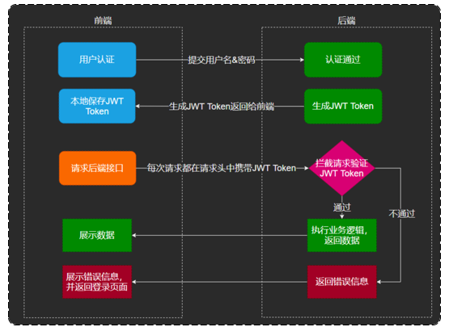

# Day02知识点总结

## 1.JWT工作原理

JWT（JSON Web Token）由3部分组成，本质上就是一个字符串：

这三部分用 **.** 分割，每一个部分都是一个JSON对象，结构是：{}.{}.{}。但是，因为要对JSON对象的内容进行编码，所以表现出来的形式是：xxx.yyy.zzz。

- Header：头部。头部由两部分组成：令牌的类型和使用的签名算法。以下就是默认的头部内容，前面算法是"HS256"，类型是"JWT"

  头部的内容会通过 **Base 64** 编码成字符串，Base 64 是一种编码规则，不是加密方式，可以通过 Base 64 解码得到头部原本的内容

```json
{
	"alg": "HS256",
	"typ": "JWT"
}
```

- Payload：负载。负载用来保存前后端需要的数据，同样是通过 Base 64 编码将一个JSON对象变成字符串。并且，因为 Base 64 可以被解码，所以不建议在负载中存放隐私数据，只用来存放一般性的数据

```json
{
    "name": "zhangsan",
    "age": 23
}
```

- Signature：签名。头部和负载是通过 Base 64 进行编码的，可以被前端解开获取里面的内容。而签名部分是通过编码后的 Header 和 Payload 以及指定的密钥，通过 Header 中指定的签名算法进行签名得到的。Signature = 签名( Header + Payload + 密钥 )

Signature的作用：用来检查 token 是否被篡改。因为 Signature =  签名( Header + Payload + 密钥 )，当有人修改头部或者负载里面的内容时，就会导致编码后的 Header 和 Payload 改变，从而引起 Signature 的改变，使得 Signature !=  签名( Header + Payload + 密钥 )，无法通过检查。



## 2.JWT的使用

引入JWT：

```xml
<dependency>
    <groupId>com.auth0</groupId>
    <artifactId>java-jwt</artifactId>
    <version>3.4.0</version>
</dependency>
```

```java
public class Main {
    public static void main(String[] args) {
        long addtionalMills = 100000;
        HashMap<String, Object> map = new HashMap<>();
        // 创建token
        String token = JWT.create()
                .withHeader(map) // 设置Header，这行代码可以写，也可以忽略
                .withClaim("name", "zhangsan") // 设置Payload
                .withClaim("age", 23)
                .withExpiresAt(new Date(System.currentTimeMillis() + addtionalMills)) // 设置过期时间
                .sign(Algorithm.HMAC256("secretKey")); // 设置密钥
        System.out.println(token);
        /*
        eyJ0eXAiOiJKV1QiLCJhbGciOiJIUzI1NiJ9.
        eyJuYW1lIjoiemhhbmdzYW4iLCJleHAiOjE3NDA3NDUyNTAsImFnZSI6MjN9.
        sfSdS5yvkgeYedloebcOMM5Nx0GqMa_bKR8wlaHeEN8
         */

        // 解析token
        // 获取验证对象
        JWTVerifier jwtVerifier = JWT.require(Algorithm.HMAC256("secretKey")).build();
        // 验证对象解析token，得到解码后的token
        DecodedJWT decodedJWT = jwtVerifier.verify(token);

        System.out.println(decodedJWT.getHeader()); // eyJ0eXAiOiJKV1QiLCJhbGciOiJIUzI1NiJ9

        System.out.println(decodedJWT.getPayload()); // eyJuYW1lIjoiemhhbmdzYW4iLCJleHAiOjE3NDA3NDU1ODcsImFnZSI6MjN9

        System.out.println(decodedJWT.getSignature()); // ghGm1GMw00HinxNTE4i3OZPh266vCDh9DYuiS8mph3c

        String name = decodedJWT.getClaim("name").asString();
        Integer age = decodedJWT.getClaim("age").asInt();
        System.out.println(name); // zhangsan
        System.out.println(age); // 23
    }
}
```

JWT的使用主要就是两个方法：create方法、require方法，具体的作用有：生成token、验证token、获取token中的数据，可以将这两个方法封装成工具类。

```java
public class JWTUtil {
    private static final String secret = "secretKey";

    /**
     * 获取token
     * @param map
     * @return
     */
    public static String createToken(Map<String, String> map) {
        long addtionalMills = 1000 * 60 * 60 * 24 * 7;
        JWTCreator.Builder builder = JWT.create();
        // 将map的内容写入Payload
        map.forEach((k, v) -> {
            builder.withClaim(k, v);
        });
        String token = builder.withExpiresAt(new Date(System.currentTimeMillis() + addtionalMills)) // 7天
                .sign(Algorithm.HMAC256(secret));// 设置密钥
        return token;
    }

    /**
     * 验证token
     * @param token
     */
    public static void verifyToken(String token){
        JWT.require(Algorithm.HMAC256(secret)).build().verify(token);
    }

    /**
     * 获取token的信息
     * @param token
     * @return
     */
    public static DecodedJWT getInfoFromToken(String token){
        return JWT.require(Algorithm.HMAC256(secret)).build().verify(token);
    }
}
```

在JavaWeb中，JWT通常用来作为验证用户登录的工具。

- 创建 interceptor 包，创建 JWTInterceptor 类，实现 HandlerInterceptor 接口，重写 preHandler方法

```java
    public boolean preHandle(HttpServletRequest request, HttpServletResponse response, Object handler) throws Exception {
        //判断当前拦截到的是Controller的方法还是其他资源
        if (!(handler instanceof HandlerMethod)) {
            //当前拦截到的不是动态方法，直接放行
            return true;
        }

        //1、从请求头中获取令牌
        String token = request.getHeader(jwtProperties.getAdminTokenName());

        //2、校验令牌
        try {
            log.info("jwt校验:{}", token);
            Claims claims = JwtUtil.parseJWT(jwtProperties.getAdminSecretKey(), token);
            Long empId = Long.valueOf(claims.get(JwtClaimsConstant.EMP_ID).toString());
            log.info("当前员工id：", empId);
            //3、通过，放行
            return true;
        } catch (Exception ex) {
            //4、不通过，响应401状态码
            response.setStatus(401);
            return false;
        }
    }
```

- 要使用这个拦截器，还需要注册拦截器，创建 config 包，创建 JWTConfiguration 类，继承 WebMvcConfigurer 接口，重写 addInterceptors 方法注册拦截器

```java
    @Autowired
    private JWTInterceptor jwtInterceptor;

    /**
     * 注册自定义拦截器
     *
     * @param registry
     */
    protected void addInterceptors(InterceptorRegistry registry) {
        log.info("开始注册自定义拦截器...");
        registry.addInterceptor(jwtInterceptor)
                .addPathPatterns("/admin/**")
                .excludePathPatterns("/admin/employee/login");
    }
```


## 3.全局异常处理类

这个是本项目中的全局异常处理类：

```java
/**
 * 全局异常处理器，处理项目中抛出的业务异常
 */
@RestControllerAdvice
@Slf4j
public class GlobalExceptionHandler {

    /**
     * 捕获业务异常
     * @param ex
     * @return
     */
    @ExceptionHandler
    public Result exceptionHandler(BaseException ex){
        log.error("异常信息：{}", ex.getMessage());
        return Result.error(ex.getMessage());
    }

}
```

- **@RestControllerAdvice**：相当于 **@ControllerAdvice + @ResponseBody**，可以统一返回 JSON 格式的错误信息。
- **@ExceptionHandler**：这里的 @ExceptionHandler 没有指定要捕获什么类型的异常，这种情况下，Spring 会自动根据形参进行判断，相当于 @ExceptionHandler(BaseException.class)。

全局异常处理类不需要额外的配置或注册，Spring Boot 会自动扫描并生效。它和拦截器（HandlerInterceptor）不同，拦截器必须手动添加到 `WebMvcConfigurer` 中，而全局异常处理类只要被 Spring 扫描到，就会自动拦截异常。


## 4.Mapper映射xml文件

```yml
mybatis:
  #mapper配置文件
  mapper-locations: classpath:mapper/*.xml
  type-aliases-package: com.sky.entity
  configuration:
    #开启驼峰命名
    map-underscore-to-camel-case: true
```

**mapper-locations: classpath:mapper/*.xml**：指定 MyBatis 映射 XML 文件的位置，用于 加载 SQL 语句映射文件（`*.xml`），从而让 MyBatis 知道如何执行 SQL 查询、插入、更新、删除操作。

classpath: → 表示从 `resources` 目录开始查找（`src/main/resources/`）。

mapper/:  → 表示在 `resources/mapper/` 目录下查找。

\*.xml: → 表示匹配所有以 `.xml` 结尾的文件（即所有 MyBatis 的 SQL 映射文件）。

```xml
<?xml version="1.0" encoding="UTF-8" ?>
<!DOCTYPE mapper PUBLIC "-//mybatis.org//DTD Mapper 3.0//EN"
        "http://mybatis.org/dtd/mybatis-3-mapper.dtd" >
<mapper namespace="com.sky.mapper.EmployeeMapper">
    <insert id="addEmployee" >
        insert into `employee`(name, username, password, phone, sex, id_number, status, create_time, update_Time,
                               create_user, update_user)
        values (#{name}, #{username}, #{password}, #{phone}, #{sex},
                #{idNumber}, #{status}, #{createTime},
                #{updateTime}, #{createUser}, #{updateUser});
    </insert>
</mapper>
```

**namespace="com.sky.mapper.EmployeeMapper"**：建立这个 xml 文件和 Mapper 类的映射关系。只要有一个 EmployeeMapper.class，就有一个 EmployeeMapper.xml。

**id="addEmployee"**：建立 SQL 操作和 Mapper 类方法的映射关系，在 EmployeeMapper 类中有一个 addEmployee 方法，就对应 EmployeeMapper.xml 中的一个标签，这个标签的 id 就是 addEmployee。

在 SQL 操作的语句中，除了 id 属性，还有其他属性：

| 属性             | 作用                                                    |
| ---------------- | ------------------------------------------------------- |
| keyProperty      | 指定实体类中用来接收主键的字段                          |
| keyColumn        | 指定数据库表的主键列名                                  |
| useGeneratedKeys | 将数据库自动生成的主键返回给实体类（`true` = 获取主键） |

通过 useGeneratedKeys 和 keyProperty，可以在插入操作中获取新记录的主键值。


## 5.ThreadLocal

ThreadLocal为每个线程提供一份单独的存储空间，具有线程隔离的效果，只有在线程内才能获取到对应的值，线程外则不能访问。

客户端发送的每次请求，Tomcat服务器都会分配一个独立的线程来处理请求。

ThreadLocal的方法：

- public void set(T value)：向当前线程内存放变量
- public T get()：获取线程内的变量
- public void remove()：移除线程内的变量

```java
public class BaseContext {

    public static ThreadLocal<Long> threadLocal = new ThreadLocal<>();

    public static void setCurrentId(Long id) {
        threadLocal.set(id);
    }

    public static Long getCurrentId() {
        return threadLocal.get();
    }

    public static void removeCurrentId() {
        threadLocal.remove();
    }

}
```

```java
        //2、校验令牌
        try {
            log.info("jwt校验:{}", token);
            Claims claims = JwtUtil.parseJWT(jwtProperties.getAdminSecretKey(), token);
            // 获取当前用户的ID并存入ThreadLocal中
            Long empId = Long.valueOf(claims.get(JwtClaimsConstant.EMP_ID).toString());
            BaseContext.setCurrentId(empId);

            log.info("当前员工id：", empId);
            //3、通过，放行
            return true;
        } catch (Exception ex) {
            //4、不通过，响应401状态码
            response.setStatus(401);
            return false;
        }   
        
        // ==========================================================
        
        // 设置创建用户，更新用户
        // 从ThreadLocal中获取用户ID
        Long id = BaseContext.getCurrentId();
        employee.setCreateUser(id);
        employee.setCreateUser(id);
        // 从ThreadLocal中删除用户ID
        BaseContext.removeCurrentId();
```


## 6.PageHelper

PageHelper 是一个用来简便数据库分页的插件。

既然是用来简便数据库分页的，那么使用 PageHelper 的时候必须要获取分页的两个重要参数：页数、页面的记录数。

具体的使用如下：

```java
    @Override
    public PageResult getEmployeePageInfo(EmployeePageQueryDTO employeePageQueryDTO) {
        // 使用PageHelper插件
        // 第一步：传递页码和每页数量
        PageHelper.startPage(employeePageQueryDTO.getPage(), employeePageQueryDTO.getPageSize());

        // 第二步：通过Mapper方法获取记录数（在xml中不需要写limit，PageHelper会根据传递的页码自动分页）
        // 返回值固定是：Page<要查询的实体类>
        // Page<E> extends ArrayList<E>，其实Page本身就是一个集合
        Page<Employee> page = employeeMapper.getEmployeeRecords(employeePageQueryDTO);

        // 获取总数、获取pageSize条记录
        long total = page.getTotal();
        List<Employee> records = page.getResult();
        return new PageResult(total, records);
    }
```

```xml
    <select id="getEmployeeRecords" resultType="com.sky.entity.Employee">
        select * from `employee`
        <where>
            <if test="name != null and name != ''">
                name like concat('%',#{name},'%')
            </if>
        </where>
        order by create_time desc
    </select>
```

- 通过 PageHelper.startPage() 获取页数和记录数
- Page\<Employee> page = employeeMapper.getEmployeeRecords(employeePageQueryDTO)，查询操作还是要手动编写 SQL。但是在 SQL 中不需要写 limit，PageHelper 会在实现查询功能的 SQL 中拼接上 limit 部分。
- order by create_time desc：所以，在order by 之后不要加分号，因为 order by 之后还要拼接 limit，如果加了分号会报错。


## 7.前端请求

前端向后端发送请求的常用方法有：

### (1)get

GET 请求用于请求资源，不会对服务器数据进行修改。请求参数通过查询参数(`URL?key=value`) 或者 路径参数(`URL/1`) 传递给后端。

GET 请求具有**幂等性**：多次请求相同的 GET 方法不会更改数据，结果相同。因为 get 方法是用来请求资源的，不会对服务器数据进行修改。

GET 请求不能使用 body，因为在 HTTP 规范（RFC 7231）指出：GET 请求的 body 没有标准意义，服务器不应该解析它。

所以，很多服务器都会直接忽视 GET 请求的 body，不会解析它。

### (2)post

POST 请求用于创建新的资源，会对服务器数据进行修改。请求参数通常放在 body 中，使用 JSON 格式。

POST 请求不具备**幂等性**：多次发送相同 POST 请求可能会创建多个相同资源。

POST 请求可以使用查询参数和路径参数，并不是只能使用 body，但是，如果是重要的数据，还是要放在 body 中传送过去。

### (3)put

PUT 请求更新资源，需要发送完整的资源数据，即全部更新。

PUT 请求具备**幂等性**：相同的 PUT 请求多次执行，结果不会变化。

POST 请求可以使用 body、查询参数、路径参数。

### (4)patch

PATCH 请求用于部分更新资源，只需要发送需要修改的字段，不影响其他字段。

PATCH 请求不具备**幂等性**：多次调用可能会有不同结果

### (5)delete

DELETE 请求用于删除资源，通常不需要 body。

DELETE 请求具有**幂等性**：多次执行相同 DELETE 请求，结果相同（删除后再删除会返回 404）。


什么是幂等性？

幂等性：同样的请求被执行多次，服务器的状态和返回结果应保持一致，即无论请求执行 1 次还是 N 次，最终效果都是一样的。